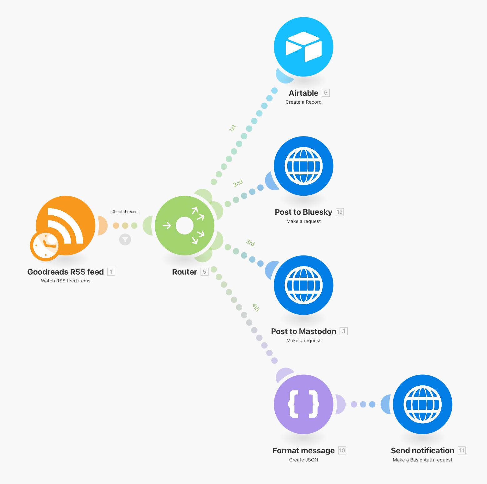
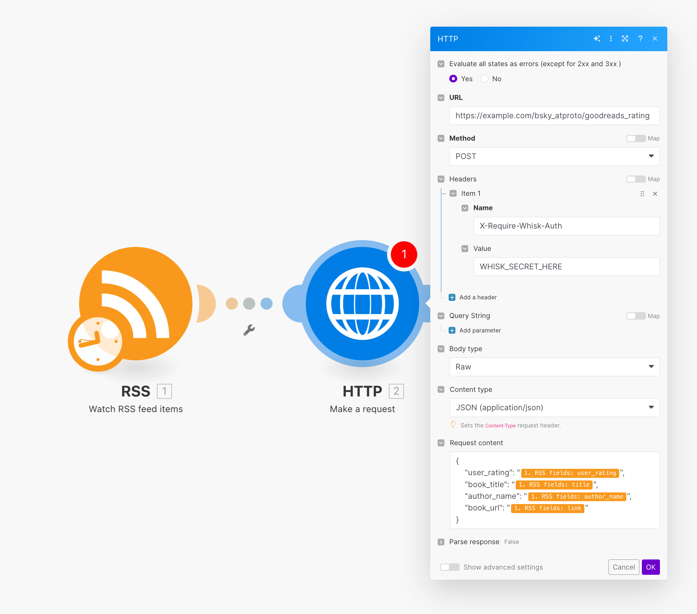

# do-bsky-atproto Goodreads example

## What this does

For years, [Goodreads](https://www.goodreads.com/) was able to connect to Twitter and autopost about books that you recorded there (but with the destruction of Twitter's APIs, this has stopped working).

I want to create the same thing, but for Bluesky using the [AT Protocol](https://atproto.com/), which provides a nice API for automaticaly posting stuff to Bluesky.

[As I describe here](https://www.andrewheiss.com/blog/2024/01/12/diy-api-plumber-quarto-ojs/_book/make.html), I use [Make.com](https://www.make.com/) to automate a lot of my personal data collection. I have a workflow that watches my Goodreads RSS feed and then does stuff with it (records the book in a central Airtable table, posts to Bluesky, posts to Mastodon, and sends me a notification through [ntfy](https://ntfy.sh/), because why not):



Posting links to Bluesky is a little trickier than Mastodon or Twitter because the AT Protocol allows you to add links with embedded previews to posts while omitting the URL from the text of the post (see ["Website card embeds"](https://docs.bsky.app/docs/advanced-guides/posts#website-card-embeds)).


Doing that, though, requires two API calls—one to upload the thumbnail image to Bluesky and one to post the full post (with thumbnail) to Bluesky. Getting all that to work with Make.com is too tricky, since it requires the ability to download and upload images.

So as a workaround, I decided to create a serverless [Function as a Service](https://docs.digitalocean.com/products/functions/) Python function at [Digital Ocean](https://www.digitalocean.com/) that can handle all the API work on-the-fly (using [the `atproto` Python module](https://atproto.blue/)) without needing a dedicated server constantly running.

The function (see `packages/bsky_atproto/goodreads_rating/__main__.py`) does this:

1. Accepts JSON data with four values:

   ```json
   {
       "user_rating": 5,
       "book_title": "Book title here",
       "author_name": "Author name here",
       "book_url": "https://www.goodreads.com/WHATEVER"
   }
   ```

2. Parses the URL to extract the title, meta description, and og:image URL

3. Uploads the thumbnail preview image to Bluesky as a blob

4. Posts this template to Bluesky with a website card embed linked to the Goodreads page:

   ```text
   {user_rating} of 5 stars to {book_title} by {author_name}
   ```


## How to deploy

1. Rename `.env.example` to `.env` and change the values there:

   - `BSKY_USER`: Your Bluesky username (e.g., `example.bsky.social`)
   - `BSKY_PASSWORD`: Your Bluesky [app password](https://bsky.app/settings/app-passwords) (*not* your account password!)
   - `WHISK`: A random string to use in the `X-Require-Whisk-Auth` header in the HTTP request that you'll make

2. [Install `doctl`](https://github.com/digitalocean/doctl/releases) locally

3. Make sure `build.sh` is executable:

   ```console
   $ chmod a+x packages/bsky_atproto/goodreads_rating/build.sh
   ```

4. Deploy the project with `--remote-build`:

   ```console
   $ doctl serverless deploy do-bsky-atproto --remote-build
   ```

   This will install everything in `requirements.txt` and make the magical function server thing work.

## How to use

Make an HTTP request with these four values, structured as JSON:

```json
{
    "user_rating": 5,
    "book_title": "Book title here",
    "author_name": "Author name here",
    "book_url": "https://www.andrewheiss.com"
}
```

There are like a billion different ways to do this. Here's the same example with curl, R, Python, and Make.com:

### curl

```console
$ curl -X POST "https://example.com/bsky_atproto/goodreads_rating" \
  -H "X-Require-Whisk-Auth: WHISK_SECRET_HERE" \
  -H "Content-Type: application/json" \
  -d '{
    "user_rating": 5,
    "book_title": "Book title here",
    "author_name": "Author name here",
    "book_url": "https://www.andrewheiss.com"
  }'
```

### R and {httr2}

```r
library(httr2)

url <- "https://example.com/bsky_atproto/goodreads_rating"

data <- list(
  "user_rating" = 5,
  "book_title" = "Book title here",
  "author_name" = "Author name here",
  "book_url" = "https://www.andrewheiss.com"
)

response <- request(url) |> 
  req_method("POST") |> 
  req_headers(`X-Require-Whisk-Auth` = "WHISK_SECRET_HERE") |> 
  req_body_json(data) |> 
  req_perform()
```

### Python and `requests`

```python
import requests

url = "https://example.com/bsky_atproto/goodreads_rating"

headers = {
    "X-Require-Whisk-Auth": "WHISK_SECRET_HERE",
    "Content-Type": "application/json"
}

data = {
    "user_rating": 5,
    "book_title": "Book title here",
    "author_name": "Author name here",
    "book_url": "https://www.andrewheiss.com"
}

response = requests.post(url, headers=headers, json=data)
```

### Make.com


